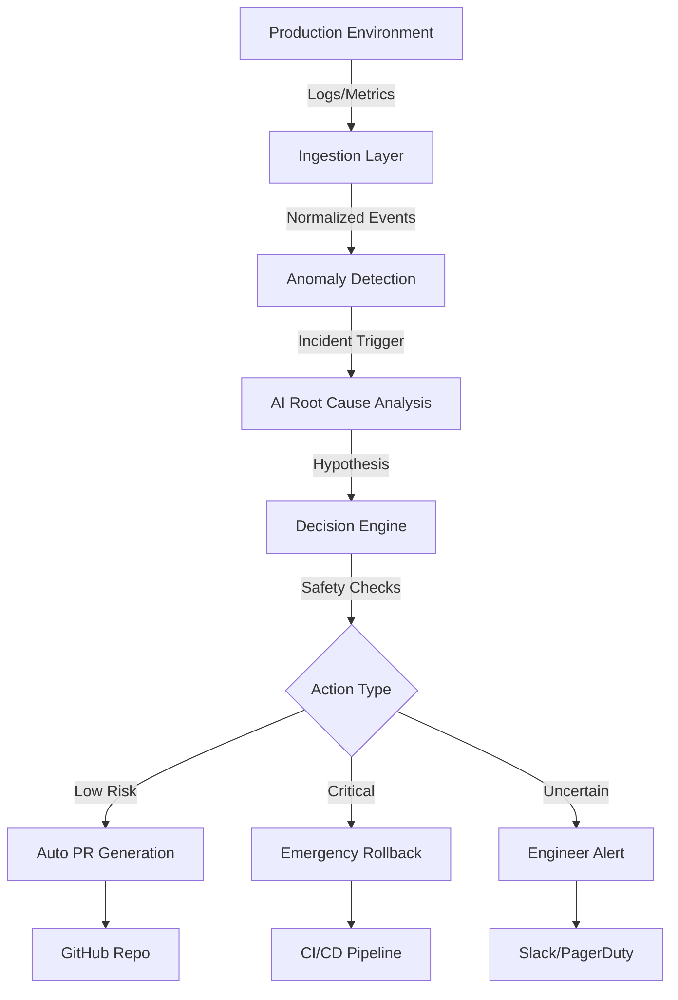
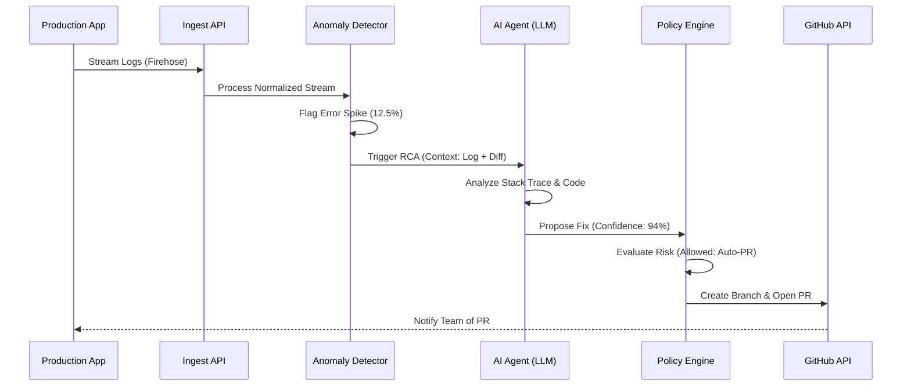

# 🛠️ Recovera

> **AI-Assisted SRE Platform for Automated Incident Remediation.**

[](LICENSE)
[](https://nextjs.org/)
[](https://www.typescriptlang.org/)
[](https://aws.amazon.com/)
[](https://ai.google.dev/)
[]()

Recovera is an intelligent SRE (Site Reliability Engineering) platform designed to bridge the gap between production anomalies and resolution. It transforms raw logs and alerts into actionable root-cause analysis (RCA) and safety-gated remediation workflows.

[**Quick Start Guide**](#-installation) | [**View Demo**](https://drive.google.com/file/d/1SfO5jKV9pYUv7NR5GFOCqIYiwpbH1St5/view?usp=drivesdk) | [**Documentation**](./docs/)

---

## 🌟 Overview

Modern engineering teams are overwhelmed by the volume of production signals. When an incident occurs, the path from **Detection** to **Resolution** is often manual, slow, and prone to fatigue. 

**Recovera solves this by:**
- **Automating Investigation**: Instantly correlates logs with recent deployments and git diffs.
- **AI-Driven RCA**: Leverages LLMs (Gemini/xAI) to hypothesize root causes with high confidence.
- **Safety-First Remediation**: Generates code fixes and opens Pull Requests only after passing policy-based safety checks.
- **Closed-Loop Learning**: Stores incident outcomes to improve future analysis accuracy.

---

## ✨ Key Features

### 📡 Foundation & Integrations
*   **Multi-Cloud Onboarding**: Seamless AWS credential management with AES-256 encryption.
*   **Resource Discovery**: Automatic mapping of AWS resources (S3, EC2, ECS) to GitHub repositories.
*   **Unified Ingestion**: Log normalization pipeline for Firehose, CloudWatch, and custom webhooks.

### 🧠 Intelligent Workflow
*   **Hybrid Detection**: Rule-based signatures for known patterns with LLM fallback for ambiguous anomalies.
*   **Contextual Analysis**: AI agents analyze stack traces, deployment history, and retrieval-augmented code snippets.
*   **Auto-Remediation**: Automated branch creation, patch application, and Pull Request generation.

### 🛡️ Safety & Governance
*   **Policy Engine**: Hardcoded guardrails (e.g., `REQUIRE_HUMAN_APPROVAL` for auth/payment systems).
*   **Sandbox Validation**: Validates generated patches against build and test suites before PR creation.
*   **Comprehensive Audit**: Detailed traces of every AI decision and action for full transparency.

---

## 💻 Tech Stack

| Category | Technologies |
| --- | --- |
| **Frontend** | Next.js 16 (App Router), React 19, Tailwind CSS 4, Framer Motion |
| **Backend** | Next.js API Routes, Node.js (TypeScript), BullMQ (Queueing) |
| **Database** | PostgreSQL, Prisma ORM, Redis (for workers) |
| **AI / ML** | Vercel AI SDK, Google Gemini, xAI, Groq |
| **Cloud (AWS)** | STS, S3, IAM, Firehose, CloudWatch, EC2/ECS/EKS |
| **DevOps** | GitHub Actions, Octokit (GitHub API), Docker |
| **Monitoring** | OpenTelemetry, Prometheus (Roadmap) |

---

## 🏗️ Architecture

Recovera follows a layered event-driven architecture designed for reliability and scalability.

### High-Level System Flow


### Incident Lifecycle Sequence


---

## 📁 Folder Structure

```bash
Recovera/
├── client/                     # Main Next.js Application
│   ├── app/                    # App Router (Pages & API)
│   │   ├── api/                # Backend API Layer
│   │   ├── dashboard/          # Incident Monitoring UI
│   │   └── repo/               # Repository Management
│   ├── components/             # UI Components (Radix/Lucide)
│   ├── lib/                    # Core Business Logic
│   │   ├── ai/                 # RCA & Fix Generators
│   │   ├── aws/                # Cloud Integration Helpers
│   │   ├── detection/          # Anomaly Engines
│   │   └── safety/             # Policy & Governance
│   ├── prisma/                 # Database Schema & Migrations
│   └── tests/                  # E2E & Integration Suites
├── docs/                       # Comprehensive Documentation
└── workers/                    # Background Processing Tasks
```

---

## 🚀 Installation

### Prerequisites
- **Node.js**: v22.12 or higher
- **PostgreSQL**: v14+ (or Supabase/Neon)
- **Redis**: For background job processing
- **AWS Account**: With IAM permissions for resource discovery

### Step-by-Step Setup

1.  **Clone the Repository**
    ```bash
    git clone https://github.com/Priyanshu8023/Recovera.git
    cd Recovera/client
    ```

2.  **Install Dependencies**
    ```bash
    npm install
    ```

3.  **Environment Configuration**
    Copy `.env.example` to `.env` and fill in your credentials.
    ```bash
    cp .env.example .env
    ```

4.  **Database Migration**
    ```bash
    npx prisma generate
    npx prisma migrate dev
    ```

5.  **Run Development Server**
    ```bash
    npm run dev
    ```

---

## 🔐 Environment Variables

| Variable | Description | Example Value | Required |
| --- | --- | --- | --- |
| `DATABASE_URL` | PostgreSQL connection string | `postgresql://...` | Yes |
| `GITHUB_ID` | GitHub OAuth App Client ID | `Ov23...` | Yes |
| `GITHUB_SECRET` | GitHub OAuth App Secret | `928d...` | Yes |
| `NEXTAUTH_SECRET` | Secret for session encryption | `your_secret` | Yes |
| `ENCRYPTION_KEY` | Key for AWS token encryption | `32_char_hex` | Yes |
| `GEMINI_API_KEY` | Google AI API Key | `AIza...` | Yes |
| `AGENT_MOCK` | Toggle AI mock mode | `false` | No |

---

## 🛡️ Security

Recovera is built with enterprise security at its core:
- **AES-256-CBC Encryption**: All cloud credentials and sensitive tokens are encrypted at rest.
- **OIDC/OAuth**: Secure authentication via GitHub NextAuth.
- **Role-Based Access**: Granular permissions for integration and action triggers.
- **Safety Guardrails**: Hardcoded policies that prevent AI from modifying critical systems (Auth, Payments, DB Migrations) without human approval.

---

## 🗺️ Roadmap

- [x] **Phase 1**: Foundation & AWS/GitHub Integration.
- [/] **Phase 2**: Real-time Log Ingestion & Anomaly Detection.
- [ ] **Phase 3**: Retrieval-Augmented Generation (RAG) for better code context.
- [ ] **Phase 4**: Multi-cloud support (GCP & Azure).
- [ ] **Phase 5**: Interactive "Chat-with-SRE" assistant.

---

## 🤝 Contributing

Contributions are what make the open-source community such an amazing place to learn, inspire, and create. Any contributions you make are **greatly appreciated**.

1. Fork the Project
2. Create your Feature Branch (`git checkout -b feature/AmazingFeature`)
3. Commit your Changes (`git commit -m 'Add some AmazingFeature'`)
4. Push to the Branch (`git push origin feature/AmazingFeature`)
5. Open a Pull Request

---

## 📜 License

Distributed under the MIT License. See `LICENSE` for more information.

  

---
  
