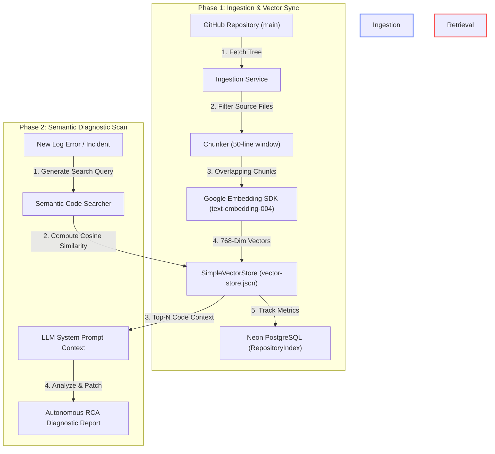
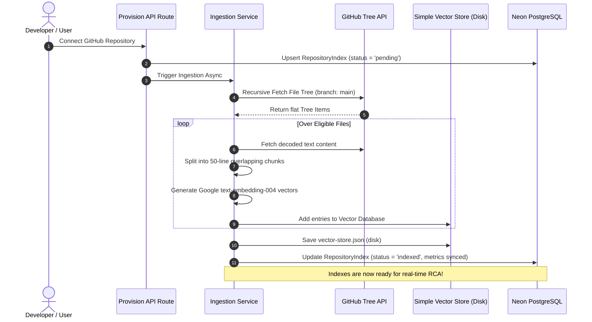
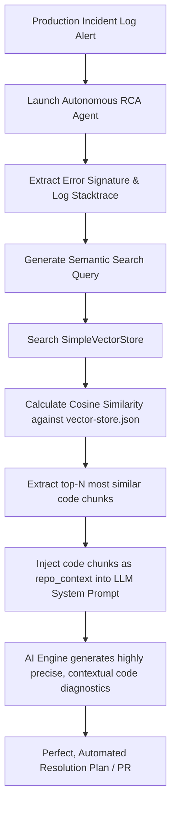

# 🧠 Vector RAG Ingestion Pipeline

This document details the architecture and implementation of Recovera’s **Retrieval-Augmented Generation (RAG)** pipeline. The RAG pipeline is the core intelligence engine that allows our autonomous Root Cause Analysis (RCA) agent to semantically scan and understand the codebase of any connected GitHub repository, pinpointing the exact files and lines of code responsible for an incident.

---

## 🗺️ High-Level System Architecture

The RAG pipeline operates in two distinct phases: **Ingestion** (offline/background sync) and **Retrieval** (real-time incident response). 



---

## ⚡ Phase 1: The Repository Ingestion Process

When a repository is connected or re-synced, the `ingestRepository()` function executes an asynchronous background worker flow.

### 1. Ingestion Lifecycle Tracking
To avoid expensive double-indexing and race conditions, state is locked in the `RepositoryIndex` PostgreSQL model:
* **`pending`**: Ingestion has started. Frontend shows a clean indexing spinner.
* **`indexed`**: Successfully compiled. Files and chunks metrics are updated, and the timestamp is logged.
* **`failed`**: An error occurred. The exact error stack is captured in `errorMessage` for developer inspection.

### 2. Recursive File Tree Discovery
We query the **GitHub Git Trees API** (`/git/trees/main?recursive=1`) to get a flat representation of all repository items.
* **File Filters (The Blocklist):** To prevent polluting the index with minified code, bundler logs, or library source code, directories like `node_modules/`, `.next/`, `dist/`, `build/`, `vendor/`, and `.git/` are strictly ignored.
* **Size Guard:** Any file exceeding **100 KB** (`MAX_FILE_BYTES`) is bypassed to prevent performance bottlenecks.
* **Supported Extensions:** Only files ending in `ts`, `tsx`, `js`, `jsx`, `py`, `go`, `java`, `rb`, `rs`, or `cs` are eligible for processing.

### 3. Slit & Overlap Chunking Strategy
Once a file is decoded from Base64, the Chunker splits the content into logical segments to optimize embedding density:

$${\color{lightblue}\text{Chunk Size}} = 50\text{ lines} \quad | \quad {\color{lightblue}\text{Chunk Overlap}} = 10\text{ lines}$$

> [!TIP]
> **Why Overlapping?**
> Standard line splitting cuts functions or classes in half at arbitrary boundaries. By enforcing a **10-line sliding window overlap**, we ensure that variable declarations, function signatures, and imports at boundaries are kept intact, providing critical semantic context to the LLM.

### 4. Embedding Generation & Vector Storage
Chunks are batched in groups of **20** to minimize network roundtrips. For each chunk:
1. A formatted search block is compiled:
   ```text
   File: src/utils/helper.ts
   Lines: 41-90

   [50 lines of code]
   ```
2. We request embeddings from Google's `text-embedding-004` model using the Vercel AI SDK.
3. The resulting **768-dimensional coordinate vector** is pushed to the `SimpleVectorStore` alongside its metadata (file path, line bounds, text content, repository ownership).
4. The database is written synchronously to `data/vector-store.json`.

---

## 🔄 Sequence Diagram: End-to-End Ingestion Flow



---

## 🔍 Phase 2: Semantic Diagnostic Retrieval

When a production incident triggers a diagnostics run, our autonomous agent leverages the search index:



### 1. Vector Search Algorithm
We perform a local vector search using the **Cosine Similarity** formula:

$$\text{Similarity}(A, B) = \frac{A \cdot B}{\|A\| \|B\|} = \frac{\sum_{i=1}^{n} A_i B_i}{\sqrt{\sum_{i=1}^{n} A_i^2} \sqrt{\sum_{i=1}^{n} B_i^2}}$$

This calculates the angular distance between the incident query vector ($A$) and our stored codebase chunk vectors ($B$). Chunks are sorted in descending order of similarity, and the **top 10 most relevant code snippets** are injected directly into the LLM system context.

---

## 🧪 Developer Offline & Mock Mode

Setting up cloud environments and API credentials locally can be tedious. To enable fast, offline, and zero-cost local testing, Recovera supports a full **Mock Mode**.

> [!NOTE]
> Setting **`AGENT_MOCK="true"`** in your client `.env` file switches all heavy network APIs over to fast, predictable local mock providers!

### How Mock Mode Alters the Pipeline:

| System Layer | Production Behavior (`AGENT_MOCK="false"`) | Mock Mode Behavior (`AGENT_MOCK="true"`) |
| :--- | :--- | :--- |
| **Embeddings** | Calls Google's `text-embedding-004` API. | Generates random 768-dimensional float arrays (`Math.random() - 0.5`) instantly. |
| **AI LLM Core** | Sends queries to Groq / Gemini for live agent execution. | Resolves instantly with simulated Diagnostic Reports & predefined code patches. |
| **AWS Cloud Scan** | Performs real connection tests on AWS IAM and S3 services. | Bypasses credential checks if they contain the words `"mock"` or `"test"`. |

### Configuring Local Mock Mode
To test the RAG pipeline and agent locally without API keys, update your `client/.env` file:

```env
# Toggle offline mock mode
AGENT_MOCK="true"
```

Running the test suite with `npm run test:safety` or launching the Next.js dev server (`npm run dev`) will now run successfully, completely offline!
